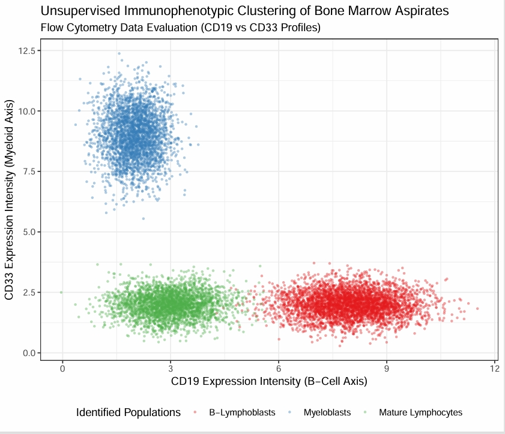

# Flow-Cytometry-Analytics
# Unsupervised Cell Clustering for Flow Cytometry Immunophenotyping

This repository implements multi-dimensional data models to process single-cell protein profiles from bone marrow aspirations using **R** biostatistical clustering loops.

## Methodology & Engineering Objectives
* **Algorithm Class:** K-Means clustering applied to multi-parameter single-cell expression points.
* **Surface Markers Analyzed:** CD34 (Stemness indicator), CD19 (B-Lineage), and CD33 (Myeloid Lineage).
* **Clinical Translation:** Automates the separation of aberrant blast populations (e.g., Myeloblasts vs B-Lymphoblasts) away from baseline mature tissue cells.

## Visual Diagnostics: Scatter Profiling
The analytical gate plot below displays how distinct immunophenotypic lineages partition across intensity metrics.

